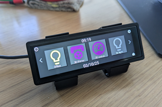

# S3LongStreamDeck
This is a StreamDeck alike device for HomeAssistant using ESPHome. I find that the [Lilygo T-Display S3 Long](ttps://lilygo.cc/products/t-display-s3-long?pr_prod_strat=jac&pr_rec_id=decea97a3&pr_rec_pid=7526315688117&pr_ref_pid=8060214935733&pr_seq=uniform) Is a nice and affordable device with Touch screen in a nice finish to he front and a ESP32-c3 onboard.

The T-Deck has 2 pages with 4 action buttons each and a 3D printer status page.
on top of that does it has a full display clock and a set up page, currently shoving name and IP Address.

The project is build so that it is fairly easy to change actions, icons and color on each button.

## Configuring the T-Deck
This section wil show you have to modify the Actin and 3D printer references. It will not cover at length how to add add more pages or more action types. Let me know if that is needed.

I have gone a long way to make ie semi easy to modify the T-Deck to match your HA setup.

There is a big section in the start of the YAML file that will control what actions, and 3D printer references can be set:
TODO

---
### References
I have used allot of different projects as inspiration and **A huge Thanks to all of them** to get me started.

**S3-Long projects**
- Aguacatec - Some is in spanish but here is a [community post in english](https://community.home-assistant.io/t/lilygo-t-display-s3-long-habbit-desk/839149)

- A very cool Air quality Sensor from Yash Mulgaonkar called [Halo](https://github.com/yashmulgaonkar/halo)

Both projects is using External components for the display, but allot of help

**Other Projects**

- [ESP32-CYD-ESPHOME](https://github.com/makeitworktech/ESP32-CYD-ESPHome) project from Make IT Work Tech - For inspiration on the HA integration 
- [Build Your Own Touchscreen Desk Controller with ESP32 + Nextion + ESPHome!](https://www.youtube.com/watch?v=jZzNDveuDVY&t=748s) Project to control his desk - Helped on ESPHome corky coding for the actions 
